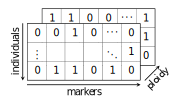

Data format
=================

We explain here how we represent genomes in silico and how to format the genetic linkage map spreadsheet.

Genome data
------------------

We represent an individual using a boolean array with a shape of ``(m, d)``, where `m` corresponds to the total number of markers, and `d` represents the ploidy. Thus, the genome data of a population is an array of shape ``(n, m, d)``, where `n` is the size of the population. Each element in the boolean array represents the presence or absence of a specific genetic marker. Note that we don't differentiate the various chromosomes on separate axes, but we do distinguish the haploids.

We load and save the genome data using the homonymous NumPy functions. As a result, the file format of the genome data follows the NPY format; for more information please consult the `NumPy's documentation <https://numpy.org/doc/stable/reference/generated/numpy.lib.format.html#module-numpy.lib.format>`_. 

Genetic linkage map
-------------------------

The genetic linkage map is a spreadsheet that provides information about marker effects for traits, chromosome identifiers, and marker positions measured in `centiMorgans` (cM). 
The column labeled ``CHR.PHYS`` indicates the chromosome identifier, while the column labeled ``cM`` represents the marker position. Each trait has its own column in the spreadsheet. 
Each row in the spreadsheet corresponds to a single marker. 
Here's an example of how a spreadsheet for a genetic linkage map might appear:

+--------------+--------------+--------------+--------------+-------------+
| CHR.PHYS     | cM           | Yield        | Height       | Protein     |
+==============+==============+==============+==============+=============+
| 1A           | 0            | 0.0378       | 0.0189       | 0.0027      |
+--------------+--------------+--------------+--------------+-------------+
| 1A           | 32.79        | 0.0721       | -0.0867      | 0.0010      |
+--------------+--------------+--------------+--------------+-------------+
| ...          | ...          | ...          | ...          | ...         |
+--------------+--------------+--------------+--------------+-------------+
| 7B           | 139.78       | -0.0123      | -0.0129      | 0.0031      |
+--------------+--------------+--------------+--------------+-------------+
| 7B           | 152.78       | 0.1082       | 0.1201       | -0.0017     |
+--------------+--------------+--------------+--------------+-------------+

We deliver with the package a sample genome data and genetic linkage map adapted from `Wang, Shichen et al. "Characterization of polyploid wheat genomic diversity using a high-density 90 000 single nucleotide polymorphism array". Plant Biotechnology Journal 12. 6(2014): 787-796.`